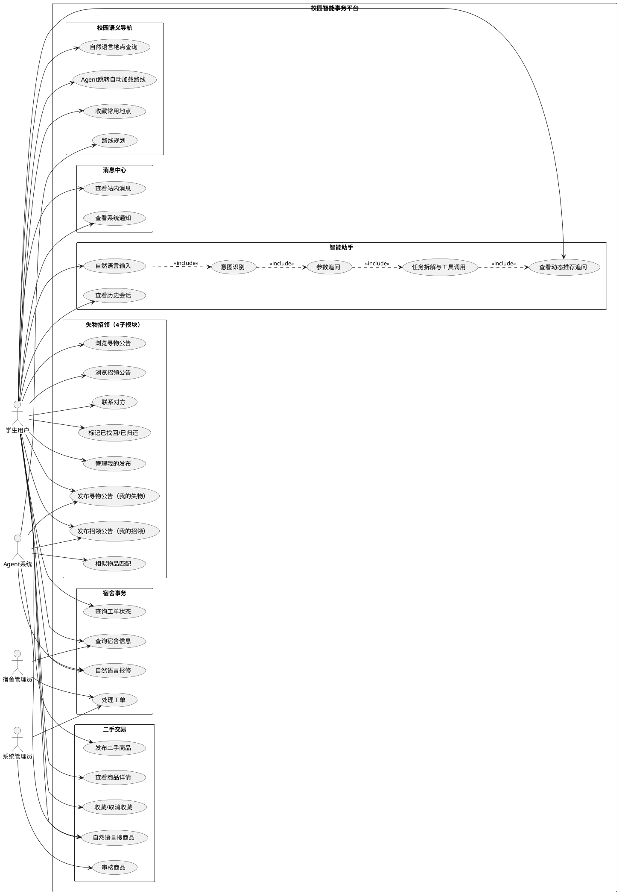
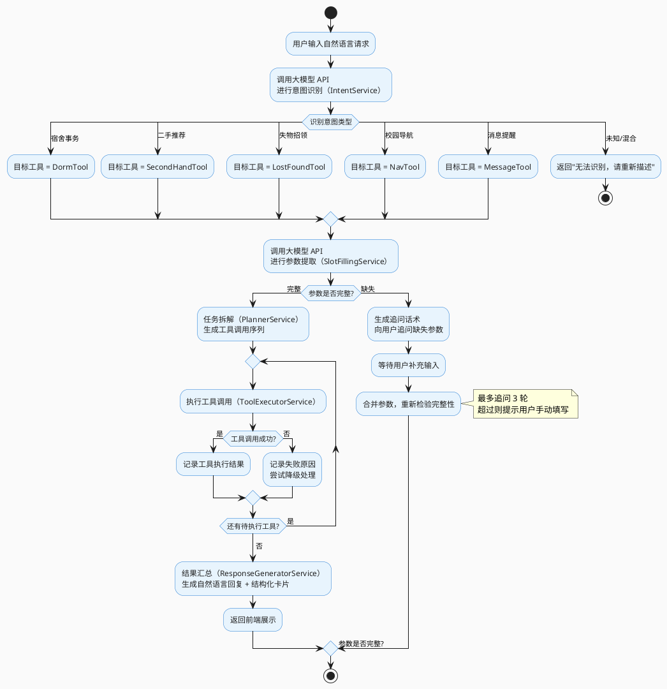
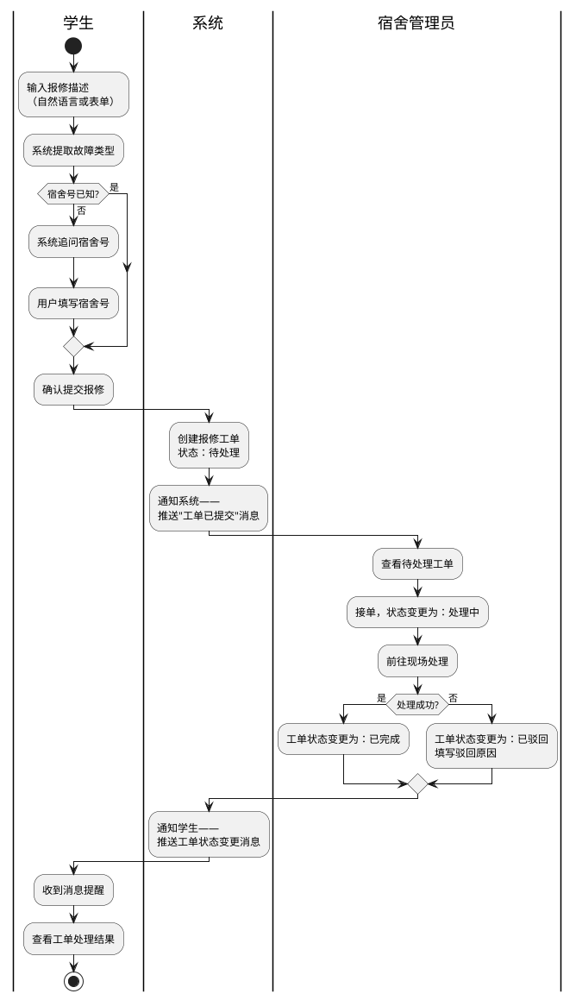
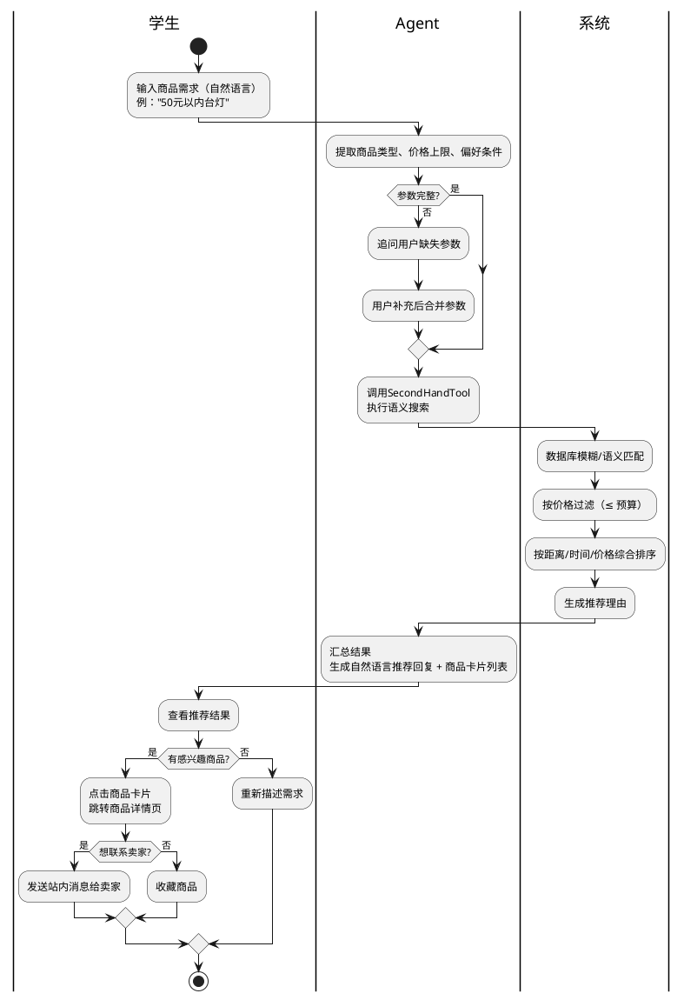
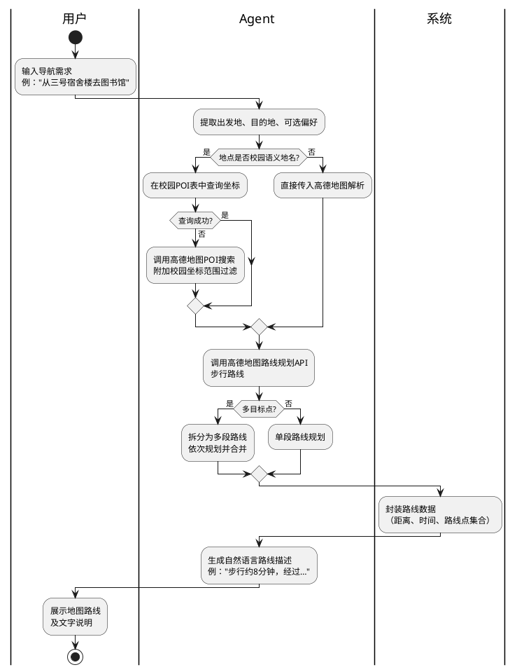
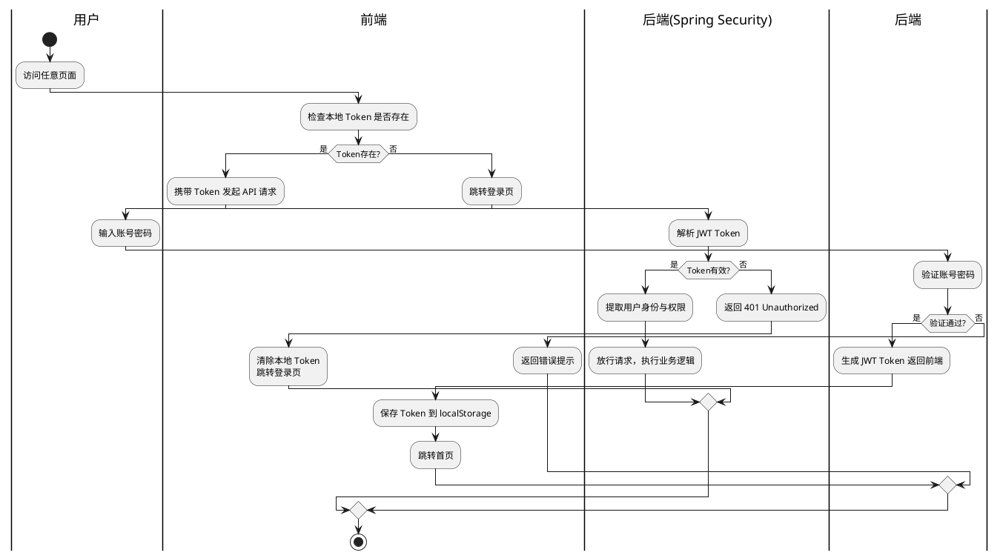
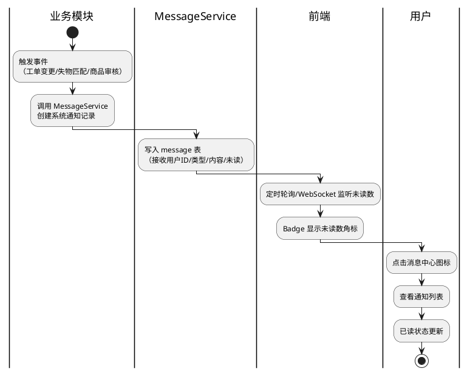
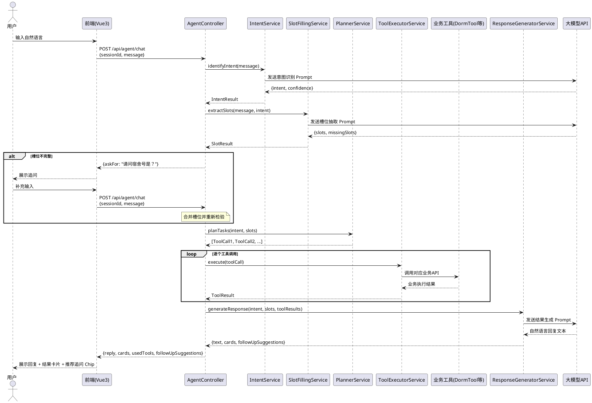
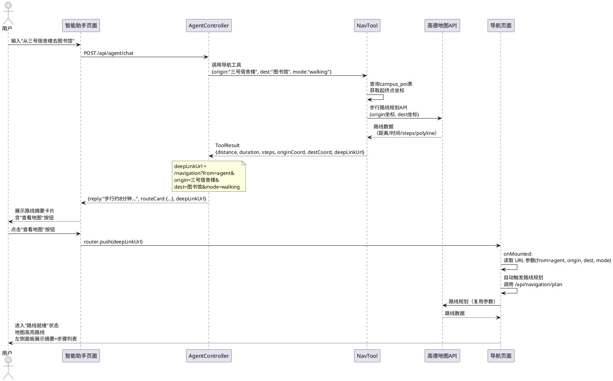
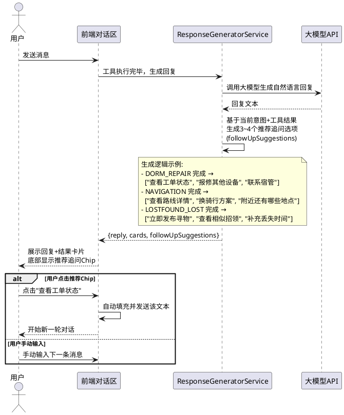

# 基于 Agent 的高校校园智能事务处理平台 —— 业务流程图与用例图

**版本：** 2.0  
**日期：** 2026年3月  
**图表语言：** PlantUML（编译工具：https://plantuml.com 或本地 plantuml.jar）

---

## 编译说明

所有图表均使用 PlantUML 语法编写。  
编译命令：`java -jar plantuml.jar <文件名>.puml`  
或将代码块内容粘贴至 https://www.plantuml.com/plantuml/uml/ 在线预览。

---

## 一、总体用例图



---

## 二、Agent 核心工作流程图



---

## 三、宿舍报修业务流程图



---

## 四、二手交易智能推荐流程图



---

## 五、失物招领智能匹配流程图

```plantuml
@startuml lostfound_flow
skinparam defaultFontName "Microsoft YaHei"

start

if (用户角色?) then (失主：我丢失了)
    :填写失物信息\n（名称/颜色/地点/时间/描述）;
    |系统|
    :在拾物记录中执行语义匹配;
else (拾主：我捡到了)
    :填写拾物信息\n（名称/颜色/地点/时间/描述）;
    |系统|
    :在失物记录中执行语义匹配;
endif

:计算相似度（关键词+时间+地点权重）;
:按相似度降序排列候选列表;

if (最高相似度 > 阈值?) then (是)
    :主动推送——\n向失主和拾主各发一条消息提醒;
else (否)
    :展示候选结果列表（供手动判断）;
endif

|用户|
:查看匹配候选列表;

if (发现匹配项?) then (是)
    :点击联系对方（站内消息）;
    :双方确认物品;

    if (确认找回?) then (是)
        :标记失物状态为"已找回";
    else (否)
        :继续等待其他匹配;
    endif
else (否)
    :继续等待新拾物/失物记录;
endif

stop
@enduml
```

---

## 六、校园语义导航流程图



---

## 七、用户登录与权限验证流程图



---

## 八、消息通知流程图



---

## 九、Agent 工具调用序列图



---

## 十、Agent 导航深链跳转流程图（新增）



---

## 十一、失物招领 4 子模块业务流程图（重构）

```plantuml
@startuml lostfound_4tab_flow
skinparam defaultFontName "Microsoft YaHei"

start

if (用户操作类型?) then (查看公共信息)
    if (想看哪类公告?) then (寻物公告)
        :进入"寻物公告"Tab\n（全校已发布的"我丢了"帖子）;
        :按类型/关键词筛选浏览;
        if (发现可能认识的物品?) then (是)
            :点击联系失主（站内消息）;
        endif
    else (招领公告)
        :进入"招领公告"Tab\n（全校已发布的"我捡到了"帖子）;
        :按类型/关键词筛选浏览;
        if (是自己丢失的物品?) then (是)
            :点击联系拾主（站内消息）;
            :双方确认，失主标记"已找回"\n拾主标记"已归还";
        endif
    endif
else (发布我的信息)
    if (我是失主) then (我丢了)
        :输入自然语言描述\n（可通过Agent自动填写）;
        note right: Agent自动提取\n名称/颜色/地点/时间

        :确认并发布到"寻物公告";

        :系统在"招领公告"中自动搜索\n相似物品候选列表;

        if (找到相似招领?) then (是)
            :展示候选匹配列表\n（相似度排序）;
            if (相似度超过阈值?) then (是)
                :系统向双方主动推送通知;
            endif
            :失主点击发消息联系拾主;
        else (否)
            :等待后续新增招领记录;
            :系统后台持续匹配并通知;
        endif

        :成功找回后\n在"我的失物"中标记"已找回";
    else (我捡到了)
        :填写物品信息\n（可通过表单或Agent语言填写）;

        :发布到"招领公告";

        :系统在"寻物公告"中自动搜索\n相似失物候选列表;

        if (找到相似寻物?) then (是)
            :展示候选匹配列表;
            :拾主联系失主;
            :归还成功后\n在"我的招领"中标记"已归还";
        endif
    endif
else (管理我的发布)
    if (查看哪类?) then (我的失物)
        :进入"我的失物"Tab\n仅展示当前用户发布的寻物帖;
        :可修改/删除/标记已找回;
    else (我的招领)
        :进入"我的招领"Tab\n仅展示当前用户发布的招领帖;
        :可修改/删除/标记已归还;
    endif
endif

stop
@enduml
```

---

## 十二、动态追问推荐机制流程图（新增）


