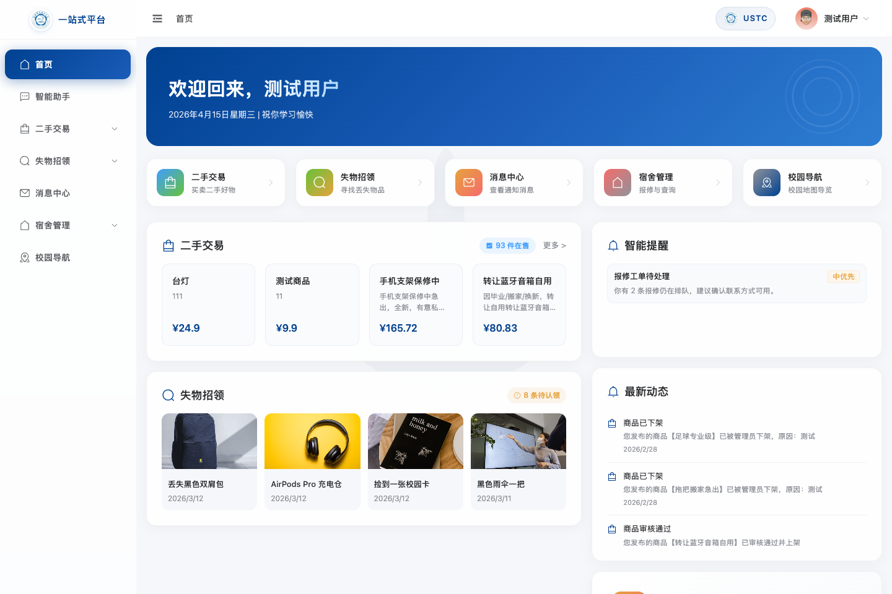
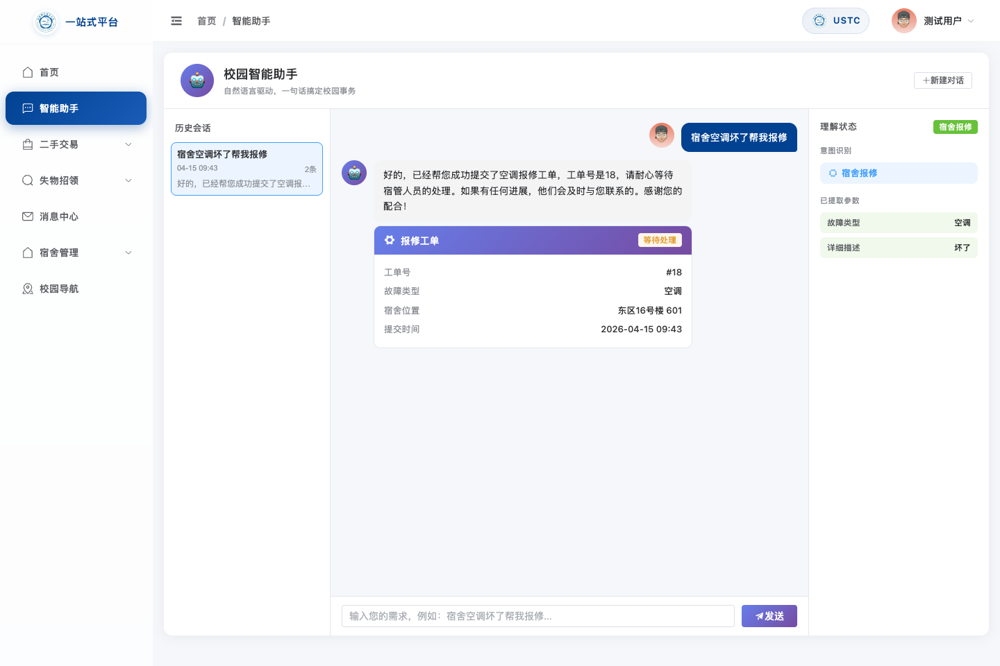
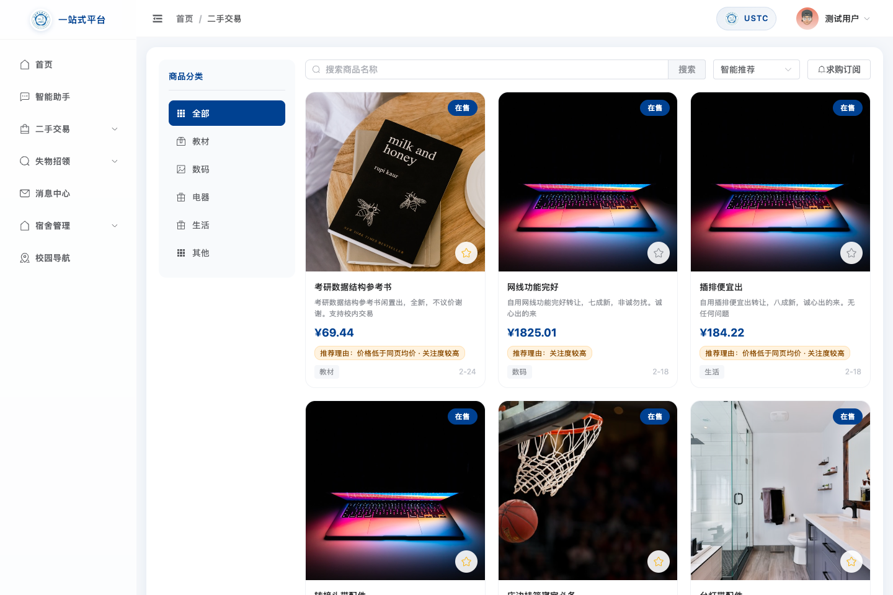
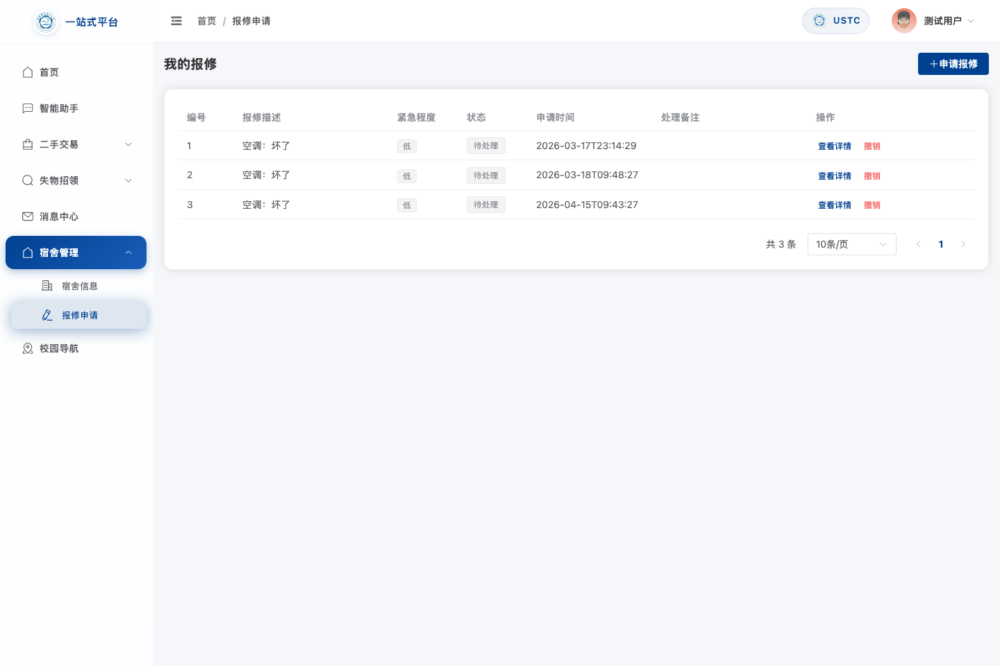
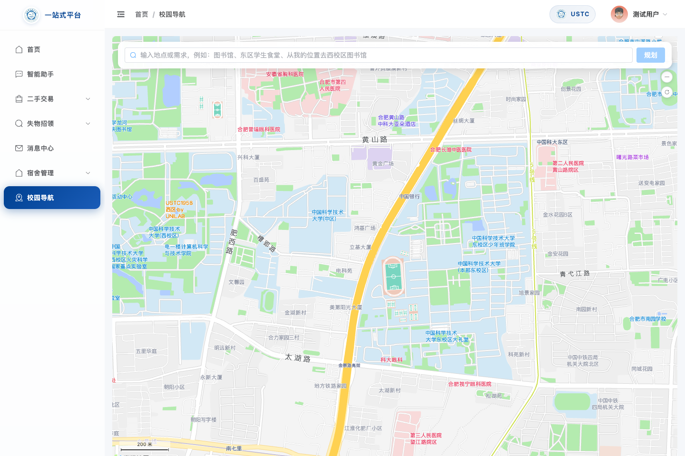

# 工程实践汇报（MCP链路场景图文版·真实截图版）

## 一、汇报调整说明

根据老师提出的“**MCP关键是链路，你们要有场景，为什么要链路**”这一建议，本次汇报不再单独把 MCP 当作一项孤立的技术接入内容来介绍，而是将其放回到真实校园业务场景中进行说明。新的表达重点，是系统为什么需要一条统一的工具调用链路，以及这条链路如何把 Agent 与宿舍报修、二手交易、校园导航等业务模块串联起来，形成可执行、可联动、可闭环的服务流程。

本版文档中的项目截图，均来自 2026 年 4 月 15 日项目真实运行界面截取，用于支撑“系统已经实际跑通，并能够承接多模块业务场景”的说明。

## 二、项目现状与链路建设目标

当前校园一站式平台已经集成首页总览、智能助手、二手交易、失物招领、消息中心、宿舍管理和校园导航等多个模块。从系统形态上看，项目已经具备较完整的校园事务平台基础；但从用户体验上看，如果各模块彼此独立，用户仍需要自行判断该进入哪个页面、手动补全哪些信息、再分别完成后续处理。

因此，项目当前要解决的关键问题，并不是“页面是否已经存在”，而是“用户能否通过一句自然语言发起需求，并由系统继续完成理解、调用、跳转和结果返回”。这正是 MCP 链路建设的意义所在。

{ width=15.5cm }

## 三、为什么要强调“链路”

老师强调“关键是链路”，本质上是在提醒我们：项目汇报不能只讲“接了 MCP 协议、做了超时和熔断”，而要先讲清楚系统面对的真实问题，以及为什么必须把多个模块串起来。

如果没有统一链路，Agent 最多只能完成意图识别和文本回答；真正的业务操作仍然需要用户手动进入不同页面分别办理。这样虽然看起来具备智能助手能力，但并没有真正提高校园事务处理效率。

而当链路建立之后，系统就可以按照如下方式组织真实任务流程：

用户自然语言提出需求 -> Agent 识别意图并补全参数 -> 调用业务工具 -> 进入具体业务模块 -> 返回结构化结果 -> 页面联动与后续办理

也就是说，MCP 在本项目中的价值，不是“单次调用了某个工具”，而是帮助系统把分散的业务能力组织成完整服务链路。

## 四、智能助手作为统一事务入口

在项目整体架构中，智能助手并不只是一个聊天窗口，而是用户进入各类校园事务场景的统一入口。用户可以从这里发起宿舍报修、二手检索、失物求助、校园导航等需求，系统再根据意图和参数情况，决定后续调用哪些业务工具以及跳转到哪个模块继续承接。

因此，从汇报逻辑上看，Agent 的价值并不在于“界面上有一个输入框”，而在于它承担了统一入口、参数补全和任务分发这三项职责。MCP 所支撑的，正是这条从“自然语言输入”到“业务能力执行”的中间连接链路。

{ width=15.5cm }

## 五、典型场景一：二手交易推荐与检索链路

二手交易场景体现的是“需求表达 -> 条件提取 -> 检索推荐 -> 页面承接”的链路逻辑。对于用户而言，其真实需求通常不是先进入二手页面再逐项筛选，而是直接说出条件，例如“帮我找一个预算 100 元以内的台灯”。

在该场景中，系统可以先由 Agent 提取商品类型、价格区间和其他偏好条件，再调用检索与推荐相关工具，将结果整理后引导进入商品页面浏览详情、继续筛选或后续沟通。这样，二手交易模块不再是孤立页面，而是成为链路中的实际承接节点。

{ width=15.5cm }

## 六、典型场景二：宿舍报修办理链路

宿舍报修是最适合说明“为什么需要链路”的事务场景之一。用户真正的需求不是“让我看到一个报修表单”，而是“我说一句宿舍空调坏了，系统能不能继续帮我把报修办下去”。

在这一场景下，完整链路应当包括：

1. 用户在智能助手中提出报修需求。
2. 系统识别为宿舍报修意图，并提取故障类型、位置、描述等参数。
3. 当关键字段缺失时，由 Agent 继续追问补全。
4. 参数完整后，系统调用报修相关工具完成工单提交。
5. 提交结果再由业务页面继续承接，供用户查看工单状态、处理详情和后续进展。

因此，在汇报时，宿舍报修不应被讲成“又做了一个报修页面”，而应强调它是 MCP 链路从“自然语言输入”走向“真实事务办理”的典型案例。

{ width=15.5cm }

## 七、典型场景三：校园导航联动链路

校园导航场景体现的是另一类链路，即“语义地点理解 -> 路线规划 -> 地图页面联动展示”。相比普通地图应用，校园导航不仅要识别地点，还要理解校园语义、路径偏好以及用户当前场景，如“避开人群”“更安全”“赶时间优先最快”等。

在本项目中，导航模块的意义并不是单独展示一张地图，而是在整体链路中承担“结果展示与交互承接”的角色。也就是说，前端导航页展示的是路线结果，前置的意图识别、参数抽取和工具调用则由 Agent 统一完成。

这样一来，导航页面就不再只是一个孤立地图页，而是链路中从“自然语言导航请求”走向“可视化路线展示”的后半段。

{ width=15.5cm }

## 八、工程实现支撑与阶段性成果

虽然本次汇报重点转向场景与链路，但底层工程建设仍然是本阶段的重要成果。为保障上述链路能够稳定运行，系统已经补充了 MCP 优先调用入口、本地回退能力、统一配置管理、请求与响应关联、超时控制、连续失败熔断、外部进程生命周期管理以及参数清洗等工程支撑能力。

这些工作说明，本阶段成果并不是“仅仅完成了几个页面”或“单独接入了一个协议”，而是已经围绕真实校园事务场景，逐步建立起一套可扩展、可联动、可持续优化的统一服务链路底座。

截至目前，项目已经具备以下阶段性基础：

1. 首页与多业务模块均已实际运行，可支持持续展示。
2. 智能助手已经作为统一事务入口存在。
3. 二手交易、宿舍报修、校园导航等典型场景已具备页面承接基础。
4. MCP 链路已具备基础实现，能够为后续更多跨模块闭环场景提供支撑。

## 九、总结

综合来看，本阶段项目建设的关键进展，不在于“新增了一个技术协议”，而在于项目已经开始围绕真实校园事务场景构建统一链路。通过 Agent 这一入口，系统能够逐步把用户自然语言请求转化为参数提取、工具调用、业务处理和页面联动的完整过程。

因此，MCP 在本项目中的核心价值并不是协议本身，而是它帮助项目从“若干独立功能页面”进一步走向“能够围绕真实需求组织完整服务流程的校园智能事务平台”。这也是我们根据老师意见，对本次汇报重点所作出的核心调整。
